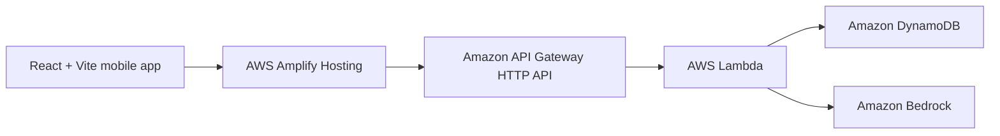

# MINT - AI Financial Decision Coach

Most money apps show where money went. MINT helps decide the next move: what to reduce, what goal becomes possible, and how a small monthly change affects the timeline.

MINT is a mobile-first React + Vite app built for the WeMakeDevs + AWS First Commit hackathon. It connects to a live AWS backend for transactions, AI coaching, and what-if explanations.

## Features

- Home dashboard with balance, income, expenses, emergency fund progress, demo data, and add transaction flow.
- Transactions page with searchable history and spending stats.
- AI coach with text and voice input, backed by Amazon Bedrock when AWS permissions are available.
- What-If simulator comparing current and improved monthly savings timelines.
- Investing guide and purchase price-watch demo for decision support.
- Settings demo imports for bank, UPI, and cards, plus a live AWS cloud status card.

## Architecture



## AWS Services

- **AWS Amplify Hosting** serves the React frontend from the `dist` build output.
- **Amazon API Gateway** exposes the HTTP API endpoints used by `src/api.js`.
- **AWS Lambda** runs the backend router and business logic in `backend/lambda/index.mjs`.
- **Amazon DynamoDB** stores demo transactions in the `mint-transactions` table with `userId` as the partition key and `id` as the sort key.
- **Amazon Bedrock** powers `/coach` and the explanation text for `/simulate`.

The backend default Bedrock model ID is:

```text
anthropic.claude-3-haiku-20240307-v1:0
```

## Live API Contract

Base URL:

```text
https://i4wv2fi3p8.execute-api.us-east-1.amazonaws.com
```

Endpoints:

- `GET /transactions`
- `POST /transactions`
- `POST /seed`
- `POST /simulate`
- `POST /coach`

## Run Locally

```bash
npm ci
cp .env.example .env.local
```

Set `.env.local`:

```text
VITE_API_URL=https://i4wv2fi3p8.execute-api.us-east-1.amazonaws.com
VITE_USE_MOCK=false
```

Start the frontend:

```bash
npm run dev
```

Use mock mode by setting:

```text
VITE_USE_MOCK=true
```

## Amplify Deployment

This repo uses a root frontend project. `amplify.yml` runs:

```bash
npm ci
npm run build
```

Artifacts are served from:

```text
dist
```

Set these Amplify environment variables:

```text
VITE_API_URL=https://i4wv2fi3p8.execute-api.us-east-1.amazonaws.com
VITE_USE_MOCK=false
```

## Roadmap

- Account Aggregator integration for real auto-tracking.
- Live price tracking for watched purchases.
- Push notifications for budget, price, and goal alerts.
- Amazon Cognito authentication for real user accounts.
